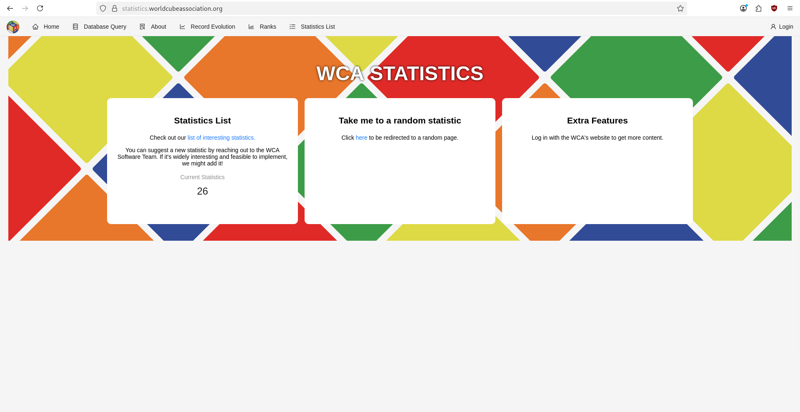
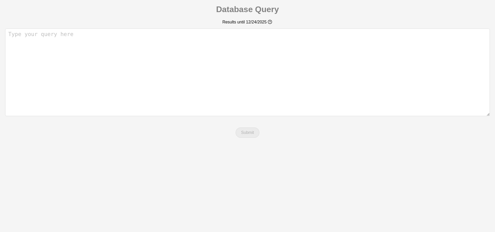
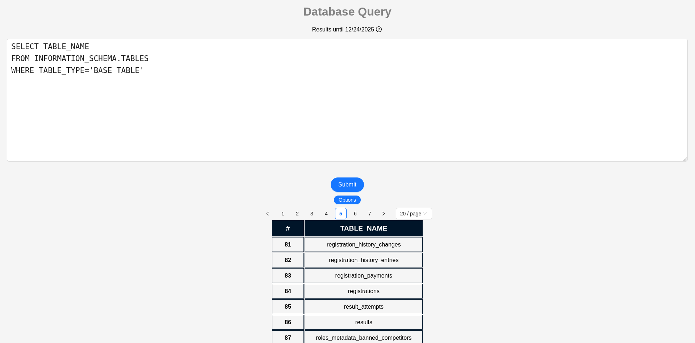
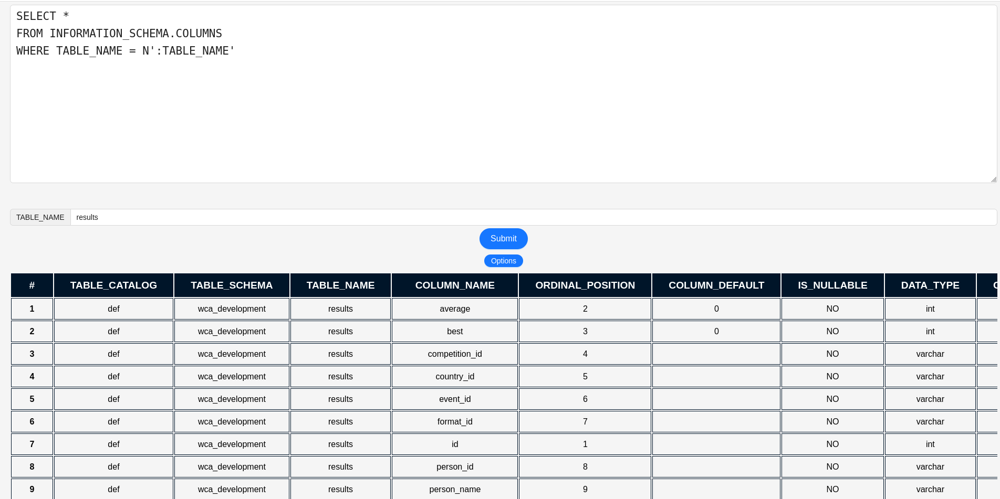

# Speedcubing Hungary Statistics

## Description

This repository contains **SQL queries for analyzing Hungarian speedcubers' statistics** from the WCA (World Cube Association) database.  
The goal is to make competitor results, national records, rankings, and other stats easily accessible.

> _This repository assumes basic familiarity with SQL.  
> You can use the pre-made queries without this knowledge, but it is necessary if you want to create custom queries._

## Contents

- `queries/` – SQL files containing different queries:
  - `all-rounder` – Queries used for the **Hungarian All-Rounder** series.
  - `end-of-year` – Queries for getting the selected year's statistics.
  - `personal` – Queries that give statistics for a single person (usually by `wca_id`).
- `schema/` – Helper queries for understanding the structure of the WCA database.
- `docs/` – Documentation about the WCA database, query conventions, and special features:
  - `naming-conventions.md` – Guidelines for file names, SQL formatting, and aliases used in queries.
  - `wca-information.md` – Explanation of named parameters and WCA-specific built-in functions.
  - `result-formats.md` – How results are stored and interpreted (time-based events, fewest moves, multi-blind).

## Usage

1. Clone the repository:

```bash
git clone https://github.com/kiaczb/speedcubinghungary-statistics.git
```

2. Using WCA Statistics

> _You need a WCA account to use the Statistics website._

Go to [https://statistics.worldcubeassociation.org/](https://statistics.worldcubeassociation.org/).


Log in with your WCA account using the top right corner.

Navigate to the `Database Query` tab.
Here you will find a text box where you can paste and run the SQL queries from this repository.



## Example

#### Exploring the database schema.

1. List available table names.

For this we are going to use the `get-table-names.sql`.



After running the query, it returns the available table names in the database that we can use.
_As you can see the results are paginated, and they are ordered alphabetically._

Now let's see what's inside the `results` table!

2. Get the `results` table schema.

Use the `get-column-properties-by-table.sql`.

After pasting the query, you will be prompted to enter the `TABLE_NAME`.
In this example use `results`.

Now we know the column names (and their types) in the `results` table, which we can use in our queries.
